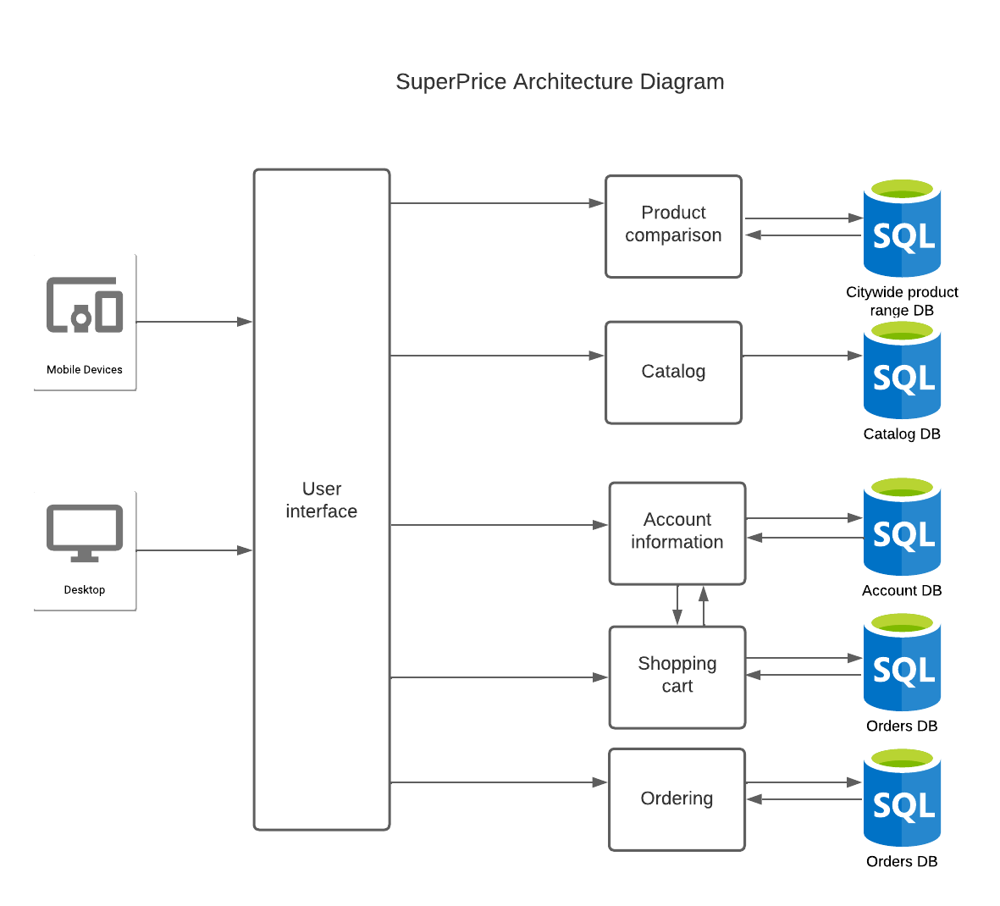
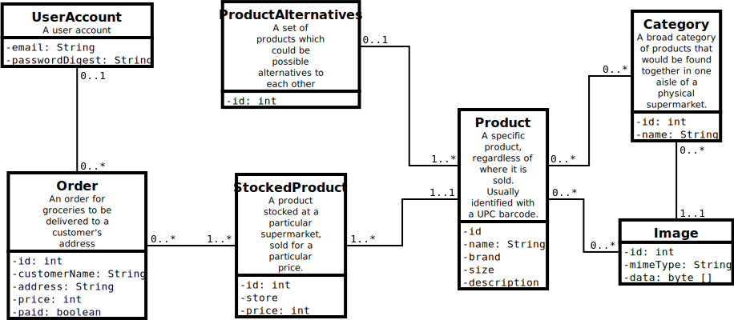

**Version 1.0 approved**

**20 August 2023**

**Table of Contents**

[**1. Introduction 1**](#introduction)

> [1.1 Purpose 1](#purpose)
>
> [**1.2 Document Conventions 1**](#_heading=)
>
> [**1.3 Intended Audience and Reading Suggestions 1**](#_heading=)
>
> [**1.4 Product Scope 2**](#_heading=)
>
> [**1.5 References 2**](#_heading=)

[**2. Overall Description 2**](#_heading=)

> [2.1 Product Perspective 2](#product-perspective)
>
> [**2.2 Product Functions 5**](#_heading=)
>
> [**2.3 User Classes and Characteristics 6**](#_heading=)
>
> [**2.4 Operating Environment 8**](#_heading=)
>
> [**2.5 Design and Implementation Constraints 8**](#_heading=)
>
> [**2.6 User Documentation 9**](#_heading=)
>
> [**2.7 Assumptions and Dependencies 9**](#_heading=)

[**3. External Interface Requirements 9**](#_heading=)

> [3.1 User Interfaces 9](#user-interfaces-tbd)
>
> [**3.2 Hardware Interfaces 9**](#_heading=)
>
> [**3.3 Software Interfaces 10**](#_heading=)
>
> [**3.4 Communications Interfaces 10**](#_heading=)

[**4. System Features 10**](#_heading=)

> [**4.1 System Feature 1 10**](#_heading=)
>
> [**4.2 System Feature 2 (and so on) 11**](#_heading=)

[**5. Other Nonfunctional Requirements
11**](#other-nonfunctional-requirements)

> [5.1 Performance Requirements 11](#performance-requirements)
>
> [**5.2 Safety Requirements 11**](#_heading=)
>
> [**5.3 Security Requirements 11**](#_heading=)
>
> [**5.4 Software Quality Attributes 11**](#_heading=)
>
> [**5.5 Business Rules 12**](#_heading=)

[**6. Other Requirements 12**](#_heading=)

**Revision History**

  ----------------------------------------------------------------------------
  **Name**        **Date**   **Reason For Changes**              **Version**
  --------------- ---------- ----------------------------------- -------------
                                                                 

                                                                 
  ----------------------------------------------------------------------------

# **Introduction**

## **Purpose** 

The purpose of this document is to specify the software requirements of
the SuperPrice application. The SRS will cover aspects such as the home
page, searching, login, product page, shopping cart and checkout. This
document will contain all parts of the application, frontend and
backend, but does not include any off-the-shelf dependencies.

## **Document Conventions**

*\<Describe any standards or typographical conventions that were
followed when writing this SRS, such as fonts or highlighting that have
special significance. For example, state whether priorities for
higher-level requirements are assumed to be inherited by detailed
requirements, or whether every requirement statement is to have its own
priority.\>*

*No conventions as of yet*

## **Intended Audience and Reading Suggestions**

  -----------------------------------------------------------------------
  **Developers**                      The document will provide detailed
                                      functional and nonfunctional
                                      requirements as well as wireframes,
                                      class diagrams and architectural
                                      diagrams of which developers can
                                      use as a reference during
                                      development.
  ----------------------------------- -----------------------------------
  **Clients**                         Clients are expected to use this
                                      document inorder to ensure that the
                                      system properly aligns with their
                                      business goal and requirements

  **Testers**                         Testers will use this document to
                                      design test cases and to ensure
                                      that the functional requirements
                                      have been met.

  **Project Managers**                Project managers will use this
                                      document to monitor the development
                                      progress and ensure that
                                      development aligns with the
                                      client's goals

  **Marketing staff**                 Marketing staff can use the
                                      document to gain an end-user's
                                      understanding of system which will
                                      help them convey the product's
                                      capabilities

  **Document writers**                Document writers will use the
                                      document to create user
                                      documentation
  -----------------------------------------------------------------------

## **Product Scope**

The SuperPrice application will be able to compare the prices of
products from a range of different super markets. Additionally, the
application will allow users to order from those super markets and have
it delivered to their address. A shopping cart system, delivery
scheduling and payments will be managed by this application.

The software is intended to help customers order their desired products
from the cheapest available super markets in a convenient way. If
implemented, this software should replace the need for shoppers to
manually compare prices across a range of different supermarket
websites, saving them time while also facilitating supermarket commerce.
This system will allow customers to do all their grocery shopping at the
cheapest price through one website.

## **References**

*\<List any other documents or Web addresses to which this SRS refers.
These may include user interface style guides, contracts, standards,
system requirements specifications, use case documents, or a vision and
scope document. Provide enough information so that the reader could
access a copy of each reference, including title, author, version
number, date, and source or location.\>*

As a part of our payment procedure, we plan on using the Stripe
financial infrastructure. More information on this service can be found
at: [[https://stripe.com/au]{.underline}](https://stripe.com/au)

# **Overall Description**

## **Product Perspective**

This is to be a new, self contained product.

The following diagram shows the architecture with which the product will
be developed.

The architecture includes the following components- React for the
frontend user interface, SpringBoot for the logic layer, MariaDB for the
store layer. Each function is self-contained, which allows for
scalability and also reduces the fallout from errors or failures.

Relevant services will communicate with each other via HHTP calls.

### Frontend - React.js

React was chosen because

-   Have to write less javascript

-   Widely used framework

-   Simple to use

-   Easy to find engineers with skills in React

### Bootstrap

Bootstrap was chosen because

-   Ease of use compared to writing CSS by hand

-   Faster development time because less code needs to be written

-   Lower development costs

-   Consistency across different platforms

### Backend - Spring Boot

Spring Boot was chosen because

-   It was recommended by the product owner

-   Extremely widely used

-   Easy to find engineers with knowledge of Spring Boot

### Relational database - MariaDB

MariaDB was chosen because

-   Need to implement search functionality - relational database has
    > much better performance for search operations than alternatives

-   SQL is standard and has the most amount of resources

-   Open source

### Payment processing - Stripe

Stripe was chosen because

-   Industry standard payment product

-   Provides consistent user interface

-   Don't have to deal with regulatory requirements for handling credit
    > card data

-   Can be integrated with very little code/effort

## **Product Functions**

The product will perform the following main functions.

-   Searchable database of supermarket products

-   Price comparison between different sellers of equivalent products

-   Ability to choose between alternative products based on price

-   Order and delivery

## **User Classes and Characteristics**

**Casual shopper**

The casual shopper uses the SuperPrice application to check the price of
availability of a product in one or more supermarkets. They might
otherwise check directly on the website of a nearby supermarket, but
it's more convenient to have one site that aggregates price information
from multiple supermarkets.

The casual shopper is likely to use the application only occasionally,
perhaps once per month. They are likely to use the product search
feature to search for products they are interested in. They might have
any level of technical expertise.

To best serve the casual shopper, the application should make specific
products as easy to find as possible using the search feature. The
search should accurately identify products relevant to the user's query
and be as fast as possible, both in the UI and in the processing of the
search.

Since the casual shopper is only an infrequent user, they are a less
important user class to serve, but maximising convenience for the search
function will create a much better experience for all users.

**Bargain hunter**

The bargain hunter uses the SuperPrice application to save as much money
as possible on groceries. If they didn't use SuperPrice, they would make
multiple search queries on the websites of multiple supermarkets to try
and find the lowest prices. Using SuperPrice would instead allow them to
make one search on one website to find the lowest price.

The bargain hunter is likely to use the application very frequently,
likely multiple times per week, in order to find deals and specials that
they can save money on. They are likely to use the product search and
browse by category, price comparison and alternative products features.
They are likely to have a higher level of technical expertise than other
users, since they would be advanced users of other shopping websites.

To best serve the bargain hunter, the application needs to identify all
possible cost saving options. The alternative products feature needs to
identify all possible alternative products, not display unsuitable
alternative products, and present the options in a clear way with price
and other information prominently displayed.

The bargain hunter is the most important class of user to serve. They
are likely to be the most frequent user of the application and earliest
adopter. Therefore, serving this user class well is key to the success
of the product.

**Working Parent**

The Working Parent uses SuperPrice to order their weekly groceries and
book deliveries. They are busy with work or family responsibilities and
they don't want to have to visit the supermarket in person. If they
didn't use SuperPrice, they would book a delivery directly on a
supermarket website, or use apps like UberEats and Doordash to have
their groceries delivered. SuperPrice can offer a more convenient
experience because it is tailored for grocery shopping unlike UberEats
and Doordash, and it allows users to order from multiple different
supermarkets on the same website, unlike supermarkets' own websites.

The Working Parent cares about saving time more than saving money.
Convenience is key for this user class. The Working Parent includes not
just parents, but also businesspeople, who might not have time to buy
groceries, and people with disabilities who might not be able to go to
supermarkets.

The Working Parent is likely to use the application moderately
frequently, perhaps once per week, in order to purchase their regular
groceries. They are likely to use the product search, browse by category
and order and delivery features. They are likely to have a moderate
level of technical expertise.

To best serve the Working Parent, the search function and browse by
category features should be as fast as possible, allowing the user to
place their grocery order quickly so they can get back to their busy
schedules. The order and delivery should also be fast and convenient.

The Working Parent is the second most important user class to serve.
They are likely to make up the bulk of users who are not bargain
hunters. They are also much less price conscious than bargain hunters,
which means that they could potentially be advertised or upsold to,
allowing opportunities for monetisation.

## **Operating Environment**

*\<Describe the environment in which the software will operate,
including the hardware platform, operating system and versions, and any
other software components or applications with which it must peacefully
coexist.\>*

## **Design and Implementation Constraints**

The design is constrained to be in a web application format due to the
client specifications. It's also constrained by elicited functional
requirements such as having a search feature, and categorisation
features. Due to unfamiliarity working with each other\'s code, the
development team together, may face inconsistency in implementation and
design. There may be a reduction of complexity so as to better improve
integration and understandability of code and design features amongst
the team.

Accessibility of external data is a concerning possible implementation
constraint. There appears to be APIs that interact with Coles and
Woolworths data, however, there are possible issues with being able to
access publicly. Undocumented private APIs may be required, or a
workaround solution such as manually entering some data, or web scraping
could be used.

Timing is a major implementation constraint. The client requirements
specify the project must work end to end at the end by the end of the
first sprint. The development team must prioritize work based on client
specifications, implementing all main functional features within a three
week period. In a following three week sprint there will be improvements
made to the quality of the code.

## **User Documentation**

As the project will be implemented as a website there will not be user
documentation provided. The nature of web applications require that the
user is able to easily understand and operate the provided
functionality. This is facilitated by intuitive user interface and user
experience design.

## **Assumptions and Dependencies**

It is assumed that there will be some appropriate method to receive
product data from major supermarkets, whether it be through public or
private APIs, or through other workarounds such as web scraping or
manual entry.

It is assumed that there is an email service that can be easily
integrated into the system if necessary.

It is assumed that the functionality of the checkout will be created by
the team and stripe will be used only for the processing of payments. It
is assumed checkout behavior can be coded in the front end, and the
database does not need to include entities such as 'cart item' or
'session'.

The project is dependent on many external systems. MySQL will be used to
implement the database. Apache server will be used to take the website
live.

There are several libraries that will be leveraged to create the system
for the application to run. SpringBoot will be used as a reliable java
framework in order to create stand-alone, secure applications. React
will be used to create a complex, interactive and modular user
interface. Java Database Connectivity (JDBC), will be implemented to
create connections to the database.

Other library dependencies include the java collections library that
will be used to implement the search comparison algorithm, and, if
required, JSoup HTML Webcrawler may be used for web scraping.

# **External Interface Requirements**

## **User Interfaces** (TBD)

*\<Describe the logical characteristics of each interface between the
software product and the users. This may include sample screen images,
any GUI standards or product family style guides that are to be
followed, screen layout constraints, standard buttons and functions
(e.g., help) that will appear on every screen, keyboard shortcuts, error
message display standards, and so on. Define the software components for
which a user interface is needed. Details of the user interface design
should be documented in a separate user interface specification.\>*

## **Hardware Interfaces** (TBD)

*\<Describe the logical and physical characteristics of each interface
between the software product and the hardware components of the system.
This may include the supported device types, the nature of the data and
control interactions between the software and the hardware, and
communication protocols to be used.\>*

## **Software Interfaces** (TBD)

*\<Describe the connections between this product and other specific
software components (name and version), including databases, operating
systems, tools, libraries, and integrated commercial components.
Identify the data items or messages coming into the system and going out
and describe the purpose of each. Describe the services needed and the
nature of communications. Refer to documents that describe detailed
application programming interface protocols. Identify data that will be
shared across software components. If the data sharing mechanism must be
implemented in a specific way (for example, use of a global data area in
a multitasking operating system), specify this as an implementation
constraint.\>*

## **Communications Interfaces** (TBD)

*\<Describe the requirements associated with any communications
functions required by this product, including e-mail, web browser,
network server communications protocols, electronic forms, and so on.
Define any pertinent message formatting. Identify any communication
standards that will be used, such as FTP or HTTP. Specify any
communication security or encryption issues, data transfer rates, and
synchronization mechanisms.\>*

# **System Features**

## ID Conventions

-   HOM ← Home page

-   PRO ← Product page

-   SEA ← Search results

-   CHE ← Checkout

-   SHO ← Shopping cart

-   LOG ← log in (sign in and sign up)

## Priority conventions 

-   Should/would/could are three categories used to describe a feature's
    > priority

## Requirement conventions 

### Description and Priority

Brief description of the feature and the priority of the feature

### Stimulus/Response Sequences

A use case for the feature and how an example of the feature responding
to user input

### Function Requirements 

-   The specific functional requirements for the feature and the
    > acceptance criteria

## 4.1 Search for products using keyword (HOM-1)

+---------------+------------------------------------------------------+
| Description   | Priority: Must                                       |
| and Priority  |                                                      |
|               | Users can search for products on the home page using |
|               | a search box                                         |
+===============+======================================================+
| Stim          | 1.  User enters name of a product into the search    |
| ulus/Response |     > box from the home page                         |
| Sequences     |                                                      |
|               | 2.  The system displays a list of matching products  |
|               |     > is displayed                                   |
+---------------+------------------------------------------------------+
| Functional    | **HOM-1.1:** A list of matching products is shown    |
| Requirements  |                                                      |
|               | Given I've entered the name of a product into the    |
|               | search box                                           |
|               |                                                      |
|               | When I hit enter                                     |
|               |                                                      |
|               | Then a list of matching products is displayed        |
+---------------+------------------------------------------------------+

##  

## 4.2 Browse by categories (HOM-2)

+---------------+------------------------------------------------------+
| Description   | Priority: Must                                       |
| and Priority  |                                                      |
|               | Users can select the category to browse from the     |
|               | home page.                                           |
+===============+======================================================+
| Stim          | 1.  From the home page user selects the browse       |
| ulus/Response |     > categories button                              |
| Sequences     |                                                      |
|               | 2.  The system displays a list of categories         |
|               |                                                      |
|               | 3.  User clicks the name of a category               |
|               |                                                      |
|               | 4.  The system shows a list of all products under    |
|               |     > that category                                  |
+---------------+------------------------------------------------------+
| Functional    | **HOM-2.1:** UI element on home page to open         |
| Requirements  | categories page or menu                              |
|               |                                                      |
|               | Given I'm on the home page                           |
|               |                                                      |
|               | When I click on the button or other UI element to    |
|               | browse categories                                    |
|               |                                                      |
|               | Then A categories page or menu opens                 |
|               |                                                      |
|               | And I see a list of all categories                   |
|               |                                                      |
|               | **HOM-2.2**: Clicking on a category on the           |
|               | categories page opens a product list page for that   |
|               | category                                             |
|               |                                                      |
|               | Given I have the categories page or menu open        |
|               |                                                      |
|               | When I click on the name of a category               |
|               |                                                      |
|               | Then A product list page opens for that category     |
|               |                                                      |
|               | And I see a list of all products in that category    |
+---------------+------------------------------------------------------+

## 

##  

## 4.3 prices shown on product page (PRO -1)

+---------------+------------------------------------------------------+
| Description   | Priority: Must                                       |
| and Priority  |                                                      |
|               | Prices from the different supermarkets are shown on  |
|               | the product page                                     |
+===============+======================================================+
| Stim          | 1.  User Clicks on a product                         |
| ulus/Response |                                                      |
| Sequences     | 2.  System shows the product page                    |
|               |                                                      |
|               | 3.  System shows the price of that product across    |
|               |     > multiple different super markets               |
+---------------+------------------------------------------------------+
| Functional    | **PRO-1.1:** List of all super markets containing    |
| Requirements  | that product is shows                                |
|               |                                                      |
|               | Given I\'m looking for a particular product          |
|               |                                                      |
|               | When I go to the product page for that given product |
|               |                                                      |
|               | Then I should see a list containing all the          |
|               | supermarkets that sell the given product             |
|               |                                                      |
|               | And the list should be sorted by price, lowest to    |
|               | highest                                              |
|               |                                                      |
|               | And I should see a price associated with each        |
|               | supermarket                                          |
|               |                                                      |
|               | **PRO-1.2**: Products that don't exist display N/A   |
|               | instead of a price                                   |
|               |                                                      |
|               | Given there exists a product that is not available   |
|               | from a supermarket                                   |
|               |                                                      |
|               | When I\'m on the product page for that product       |
|               |                                                      |
|               | Then it should display \"N/a\" instead of a price    |
+---------------+------------------------------------------------------+

##  

## 4.4 Prices shown in search results (SEA-1)

+---------------+------------------------------------------------------+
| Description   | Priority: Could                                      |
| and Priority  |                                                      |
|               | The prices of a product is shown in the search       |
|               | results                                              |
+===============+======================================================+
| Stim          | 1.  User searches for a product                      |
| ulus/Response |                                                      |
| Sequences     | 2.  System shows that product's price and the        |
|               |     > corresponding supermarket                      |
+---------------+------------------------------------------------------+
| Functional    | **SEA-1.1:** Icons in search with price for stocked  |
| Requirements  | items                                                |
|               |                                                      |
|               | Given I'm on the search results page                 |
|               |                                                      |
|               | When A product is available at a major supermarket   |
|               |                                                      |
|               | Then The search result should feature in the UI an   |
|               | icon for that supermarket                            |
|               |                                                      |
|               | And The price at that supermarket should be shown    |
|               | next to it                                           |
|               |                                                      |
|               | **SEA-1.2:** No price listed for unstocked items     |
|               |                                                      |
|               | Given I'm on the search results page                 |
|               |                                                      |
|               | When A product is not available at a particular      |
|               | major supermarket                                    |
|               |                                                      |
|               | Then The search result should not show an icon for   |
|               | that supermarket                                     |
|               |                                                      |
|               | And The search result should not show a price for    |
|               | that item at that supermarket                        |
|               |                                                      |
|               | **SEA-1.3:** Lowest price bolded                     |
|               |                                                      |
|               | Given I'm on the search results page                 |
|               |                                                      |
|               | When A product is available at a major supermarket   |
|               |                                                      |
|               | And: That supermarket offers the cheapest price      |
|               | available                                            |
|               |                                                      |
|               | Then That price should be highlighted in the UI      |
|               | (such as with bold text)                             |
+---------------+------------------------------------------------------+

##  

## 4.5 Alternative products shown on product page (PRO-2)

+---------------+------------------------------------------------------+
| Description   | Priority: Could                                      |
| and Priority  |                                                      |
|               | Similar products to the product the user is current  |
|               | viewing are shown on the product page                |
+===============+======================================================+
| Stim          | 1.  User clicks on a product                         |
| ulus/Response |                                                      |
| Sequences     | 2.  System takes user to the product page            |
|               |                                                      |
|               | 3.  System shows user alternative products           |
|               |                                                      |
|               | 4.  User clicks on one of the alternative products   |
|               |     > shown                                          |
|               |                                                      |
|               | 5.  System takes the user to that product's product  |
|               |     > page.                                          |
+---------------+------------------------------------------------------+
| Functional    | **PRO-2.1:** Alternative brands shown where          |
| Requirements  | available                                            |
|               |                                                      |
|               | Given There are multiple brands that produce a       |
|               | particular type of product                           |
|               |                                                      |
|               | When I view the product page for that product        |
|               |                                                      |
|               | Then I see a list of alternatives                    |
|               |                                                      |
|               | And The price is displayed by each one               |
|               |                                                      |
|               | **PRO-2.2:** All suitable alternatives should be     |
|               | shown                                                |
|               |                                                      |
|               | Given I\'m on the product page for a product         |
|               |                                                      |
|               | When another product could be purchased as an        |
|               | alternative to the current product                   |
|               |                                                      |
|               | Then that product is shown in the list of            |
|               | alternatives                                         |
|               |                                                      |
|               | **PRO-2.3:** No alternative brands shown, where not  |
|               | available                                            |
|               |                                                      |
|               | Given There is only one brand that produces a        |
|               | particular type of product                           |
|               |                                                      |
|               | When I view the product page for that product        |
|               |                                                      |
|               | Then I do not see a list of alternatives             |
|               |                                                      |
|               | **PRO 2.4:** Can click on alternative products to    |
|               | browse to their product page                         |
|               |                                                      |
|               | Given I'm on the product page for a product          |
|               |                                                      |
|               | And There are alternative products displayed         |
|               |                                                      |
|               | When I click on one of the alternatives in the list  |
|               |                                                      |
|               | Then The product page for the selected alternative   |
|               | is shown                                             |
+---------------+------------------------------------------------------+

## 4.6 Choosing time slot for delivery (CHE-1)

+---------------+------------------------------------------------------+
| Description   | Priority: Should                                     |
| and Priority  |                                                      |
|               | Users are able to choose a specific time slot for    |
|               | delivery of their groceries                          |
+===============+======================================================+
| Stim          | 1.  User clicks a time for the groceries to be       |
| ulus/Response |     > delivered                                      |
| Sequences     |                                                      |
|               | 2.  System notifies the confirmation of the delivery |
|               |     > time to the user                               |
+---------------+------------------------------------------------------+
| Functional    | **CHE-1.1:** Users should be able to choose a        |
| Requirements  | specific time slot from a list of available times.   |
|               |                                                      |
|               | Given I\'m on the time select page,                  |
|               |                                                      |
|               | When I click the specific time I want my groceries   |
|               | to be delivered,                                     |
|               |                                                      |
|               | I am informed my time has been confirmed.            |
|               |                                                      |
|               | **CHE-1.2:** Users should be able to edit the time   |
|               | slot chosen.                                         |
|               |                                                      |
|               | Given I\'m on the time select page,                  |
|               |                                                      |
|               | And I have already selected a time for my groceries  |
|               | to be delivered,                                     |
|               |                                                      |
|               | When I click a different specific time,              |
|               |                                                      |
|               | I am informed my new time has been confirmed.        |
|               |                                                      |
|               | **CHE-1.3:** User should not be able to select an    |
|               | unavailable time.                                    |
|               |                                                      |
|               | Given I\'m on the time select page,                  |
|               |                                                      |
|               | When I select a time that is unavailable,            |
|               |                                                      |
|               | I am informed that I must choose a different time.   |
+---------------+------------------------------------------------------+

##  

## 4.7 Viewing Shopping Cart (SHO-1)

+---------------+------------------------------------------------------+
| Description   | Priority: Must                                       |
| and Priority  |                                                      |
|               | Users can view their shopping cart                   |
+===============+======================================================+
| Stim          | 1.  User clicks on button to open shopping cart      |
| ulus/Response |                                                      |
| Sequences     | 2.  System displays the shopping cart showing the    |
|               |     > user of of their added items                   |
+---------------+------------------------------------------------------+
| Functional    | **SHO-1.2**: User can open checkout page if they     |
| Requirements  | have items in their cart                             |
|               |                                                      |
|               | Given a I am on the shopping cart page               |
|               |                                                      |
|               | And there are items in the cart                      |
|               |                                                      |
|               | When I click the check out button                    |
|               |                                                      |
|               | Then I am taken to the checkout page                 |
|               |                                                      |
|               | **SHO-1.2:** Shopping cart page shows all items      |
|               | added to the cart                                    |
|               |                                                      |
|               | Given I have added an item to the cart,              |
|               |                                                      |
|               | When I open the shopping cart page,                  |
|               |                                                      |
|               | Then the item is listed on the screen.               |
|               |                                                      |
|               | **SHO-1.3:** User cannot open checkout page if they  |
|               | have no items in their cart                          |
|               |                                                      |
|               | Given a I am on the shopping cart page               |
|               |                                                      |
|               | And there are items in the cart                      |
|               |                                                      |
|               | When I click the check out button                    |
|               |                                                      |
|               | Then I am not taken to the checkout page             |
+---------------+------------------------------------------------------+

##  

## 4.8 Notifications and alerts (HOM-3)

+---------------+------------------------------------------------------+
| Description   | Priority: Could                                      |
| and Priority  |                                                      |
|               | Users upon consent can receive notification or       |
|               | alerts price drops or special offers                 |
+===============+======================================================+
| Stim          | 1.  User signs up for notifications                  |
| ulus/Response |                                                      |
| Sequences     | 2.  System see that there is a price drop or special |
|               |                                                      |
|               | 3.  System notifies user with the price drop         |
+---------------+------------------------------------------------------+
| Functional    | **HOM-3.1:** Notifications for temporary price drops |
| Requirements  |                                                      |
|               | Given I'm signed up for notifications                |
|               |                                                      |
|               | When There is a temporary price drop of any kind     |
|               |                                                      |
|               | Then I get a notification                            |
|               |                                                      |
|               | **HOM-3.2A:** User should be able to enable          |
|               | notifications.                                       |
|               |                                                      |
|               | Given I\'m not signed up for notifications,          |
|               |                                                      |
|               | And I want to be notified of price drops and special |
|               | offers,                                              |
|               |                                                      |
|               | When I select the \"Get Notified\" button,           |
|               |                                                      |
|               | Then I am subscribed for all notifications.          |
|               |                                                      |
|               | **HOM-3.2B:** User should be able to disable         |
|               | notifications                                        |
|               |                                                      |
|               | Given I\'m signed up for notifications,              |
|               |                                                      |
|               | And I do not want to be notified of price drops and  |
|               | special offers,                                      |
|               |                                                      |
|               | When I select the \"Unsubscribe\" button,            |
|               |                                                      |
|               | Then I am unsubscribed from receiving notifications. |
|               |                                                      |
|               | **HOM-3.3:** User should be able to select           |
|               | specifically the notifications they want.            |
|               |                                                      |
|               | Given I\'m signed up for notifications,              |
|               |                                                      |
|               | And I only want to be notified of specific items,    |
|               |                                                      |
|               | When I select the items I want to be notified for,   |
|               |                                                      |
|               | Then I am subscribed to only receiving notifications |
|               | for those items.                                     |
+---------------+------------------------------------------------------+

##  

## 4.9 Filter search results by category (SEA-4)

+---------------+------------------------------------------------------+
| Description   | Priority: Should                                     |
| and Priority  |                                                      |
|               | Users can filter their search results by category    |
+===============+======================================================+
| Stim          | 1.  User selects to filter search results by         |
| ulus/Response |     > category                                       |
| Sequences     |                                                      |
|               | 2.  System only shows search results that correspond |
|               |     > to the chosen category                         |
+---------------+------------------------------------------------------+
| Functional    | **CAT 4.1** UI element on search results page to     |
| Requirements  | filter by category                                   |
|               |                                                      |
|               | Given I'm viewing search results                     |
|               |                                                      |
|               | When I click a UI element, such as a checkbox menu,  |
|               | to filter by category                                |
|               |                                                      |
|               | Then the search results are updated                  |
|               |                                                      |
|               | And I see a products within given categories         |
|               | relevant to search query                             |
+---------------+------------------------------------------------------+

##  

## 4.10 Sign in (LOG-1)

+----------------+-----------------------------------------------------+
| Description    | Priority: Could                                     |
| and Priority   |                                                     |
|                | User are able to sign in to the website if they     |
|                | have a valid account                                |
+================+=====================================================+
| Sti            | 1.  User puts their login information               |
| mulus/Response |                                                     |
| Sequences      | 2.  System grants them access to their account      |
+----------------+-----------------------------------------------------+
| Functional     | **LOG-1.1:** Successful login upon entering correct |
| Requirements   | details                                             |
|                |                                                     |
|                | Given I'm on the login page                         |
|                |                                                     |
|                | And I have filled my username and password details  |
|                | correctly into the form                             |
|                |                                                     |
|                | When I click the sign in button                     |
|                |                                                     |
|                | Then I will be redirected to the home page          |
|                |                                                     |
|                | And I will infer confirmation that I am signed in   |
|                |                                                     |
|                | **LOG-1.2:** Rejected login upon entering false     |
|                | details                                             |
|                |                                                     |
|                | Given I'm on the login page                         |
|                |                                                     |
|                | And I have filled my username and password details  |
|                | incorrectly into the form                           |
|                |                                                     |
|                | When I click the sign in button                     |
|                |                                                     |
|                | Then the login page will be refreshed               |
|                |                                                     |
|                | And I will not be logged in                         |
|                |                                                     |
|                | And an error message will provide visual            |
|                | confirmation of failure                             |
+----------------+-----------------------------------------------------+

##  

## 4.11 Sign up (LOG-2)

+---------------+------------------------------------------------------+
| Description   | Priority: Could                                      |
| and Priority  |                                                      |
|               | Users are able to sign up to create an account       |
+===============+======================================================+
| Stim          | 1.  User puts in their information                   |
| ulus/Response |                                                      |
| Sequences     | 2.  If valid, system creates an account using the    |
|               |     > user's information                             |
+---------------+------------------------------------------------------+
| Functional    | **LOG-2.1:** Successful login upon entering correct  |
| Requirements  | details                                              |
|               |                                                      |
|               | Given I'm on the sign up page                        |
|               |                                                      |
|               | And I have entered my username, password, password   |
|               | again details correctly into the form                |
|               |                                                      |
|               | When I click the sign in button                      |
|               |                                                      |
|               | Then I will be redirected to the home page           |
|               |                                                      |
|               | And I will infer confirmation that I now have an     |
|               | account                                              |
|               |                                                      |
|               | **LOG-2.2:** Rejected login upon both passwords      |
|               | being different                                      |
|               |                                                      |
|               | Given I'm on the sign up page                        |
|               |                                                      |
|               | And I have entered my username correctly,            |
|               |                                                      |
|               | And I have entered my password and password again    |
|               | details incorrectly into the form                    |
|               |                                                      |
|               | When I click the sign up button                      |
|               |                                                      |
|               | Then the login page will be refreshed                |
|               |                                                      |
|               | And I will not be logged in                          |
|               |                                                      |
|               | And an error message will provide visual             |
|               | confirmation of failure                              |
|               |                                                      |
|               | **LOG-2.3:** Rejected login upon entering existing   |
|               | username                                             |
|               |                                                      |
|               | Given I'm on the sign up page                        |
|               |                                                      |
|               | And I have entered my username,                      |
|               |                                                      |
|               | And my username already exists for another user      |
|               |                                                      |
|               | And I have entered my password and password again    |
|               | details correctly into the form                      |
|               |                                                      |
|               | When I click the sign up button                      |
|               |                                                      |
|               | Then the login page will be refreshed                |
|               |                                                      |
|               | And I will not be logged in                          |
|               |                                                      |
|               | And an error message will provide visual             |
|               | confirmation of failure                              |
+---------------+------------------------------------------------------+

## 4.12 Sort results by price (SEA-2)

+--------------+-------------------------------------------------------+
| Description  | Priority: should                                      |
| and Priority |                                                       |
|              | Users are able to filter their search results by      |
|              | price                                                 |
+==============+=======================================================+
| Stimu        | 1.  User searches for a product                       |
| lus/Response |                                                       |
| Sequences    | 2.  System shows them a list of corresponding         |
|              |     > products                                        |
|              |                                                       |
|              | 3.  User selects to sort prices from low to high      |
|              |                                                       |
|              | 4.  System organizes list of products from low to     |
|              |     > high                                            |
+--------------+-------------------------------------------------------+
| Functional   | **SEA-2.1**: UI element on search page to sorting     |
| Requirements | options                                               |
|              |                                                       |
|              | Given I'm on the search results page                  |
|              |                                                       |
|              | And I click the sort options drop down box            |
|              |                                                       |
|              | When I click to sort by price low to high             |
|              |                                                       |
|              | Then the search results page will refresh             |
|              |                                                       |
|              | And I see items in order of the price property, low   |
|              | to high                                               |
+--------------+-------------------------------------------------------+

## 4.13 Filter search results using minimum and maximum price filters (SEA-3)

+--------------+-------------------------------------------------------+
| Description  | Priority: Could                                       |
| and Priority |                                                       |
|              | Users are able to filter their search results by      |
|              | price by adding minimum and maximum prices.           |
+==============+=======================================================+
| Stimu        | 1.  User searches for a product                       |
| lus/Response |                                                       |
| Sequences    | 2.  System shows them a list of corresponding         |
|              |     > products                                        |
|              |                                                       |
|              | 3.  User inputs a minimum price of \$5 and maximum    |
|              |     > price of \$10                                   |
|              |                                                       |
|              | 4.  System adjusts the list of products shown to be   |
|              |     > only products that correspond to that list      |
+--------------+-------------------------------------------------------+
| Functional   | **SEA-3.1:** Minimum and maximum inputs on search     |
| Requirements | page                                                  |
|              |                                                       |
|              | Given I'm on the search results page                  |
|              |                                                       |
|              | When I input a price minimum                          |
|              |                                                       |
|              | And when I input a price maximum                      |
|              |                                                       |
|              | Then the search results page will refresh             |
|              |                                                       |
|              | And I\'ll see items within this price range           |
+--------------+-------------------------------------------------------+

## 4.14 Placing an order (CHE-2)

+---------------+------------------------------------------------------+
| Description   | Priority: Must                                       |
| and Priority  |                                                      |
|               | Users can place an order for their groceries so that |
|               | they can be delivered for them                       |
+===============+======================================================+
| Stim          | 1.  User is on the checkout page and enters their    |
| ulus/Response |     > delivery information                           |
| Sequences     |                                                      |
|               | 2.  User hit place order button                      |
|               |                                                      |
|               | 3.  System handles the order                         |
|               |                                                      |
|               | 4.  System stores the order information in a         |
|               |     > database                                       |
+---------------+------------------------------------------------------+
| Functional    | **CHE-2.1:** User can place order if all details     |
| Requirements  | filled out in checkout page                          |
|               |                                                      |
|               | Given I am on the checkout page                      |
|               |                                                      |
|               | And all my details are filled in including full      |
|               | name, shipping address, city, state / province,      |
|               | company and zip code                                 |
|               |                                                      |
|               | And I\'ve selected a preferred delivery time slot.   |
|               |                                                      |
|               | When I click the place order button                  |
|               |                                                      |
|               | Then my order is submitted                           |
|               |                                                      |
|               | **CHE-2.2:** User cannot place order if details      |
|               | missing in checkout page                             |
|               |                                                      |
|               | Given I am on the checkout page                      |
|               |                                                      |
|               | And not all details are filled in                    |
|               |                                                      |
|               | When I click the place order button                  |
|               |                                                      |
|               | Then I see an error message                          |
|               |                                                      |
|               | And no order is submitted                            |
+---------------+------------------------------------------------------+

##  

## 4.15 Credit Card Payment (CHE-3)

+----------------+-----------------------------------------------------+
| Description    | Priority: Must                                      |
| and Priority   |                                                     |
|                | Users can pay for their groceries using a credit    |
|                | card                                                |
+================+=====================================================+
| Sti            | 1.  User that is on the checkout page clicks to pay |
| mulus/Response |     > via credit card                               |
| Sequences      |                                                     |
|                | 2.  System prompts the user to pay via card         |
|                |                                                     |
|                | 3.  User enters their details on the checkout page  |
|                |                                                     |
|                | 4.  System accepts the user's details               |
|                |                                                     |
|                | 5.  System records the order information            |
+----------------+-----------------------------------------------------+
| Functional     | **CHE-3.1:** User should be prompted for payment    |
| Requirements   | when placing an order                               |
|                |                                                     |
|                | Given I\'m on the checkout page,                    |
|                |                                                     |
|                | When I click the place order button,                |
|                |                                                     |
|                | I am prompted to pay by credit card.                |
|                |                                                     |
|                | **CHE-3.2:** Order should be submitted if payment   |
|                | is successful                                       |
|                |                                                     |
|                | Given I am on the payment form,                     |
|                |                                                     |
|                | And I have entered my billing and payment details   |
|                | correctly                                           |
|                |                                                     |
|                | And I have the funds to purchase the item           |
|                |                                                     |
|                | When I submit the credit card payment               |
|                |                                                     |
|                | Then I am charged the price of the purchase         |
|                |                                                     |
|                | And I am issued a billing receipt                   |
|                |                                                     |
|                | And my order is recorded                            |
|                |                                                     |
|                | **CHE-3.3:** Order should be rejected if credit     |
|                | card payment fails                                  |
|                |                                                     |
|                | Given I am on the payment form,                     |
|                |                                                     |
|                | And I have entered my billing and payment details   |
|                | correctly                                           |
|                |                                                     |
|                | And I do not have the funds to purchase the item    |
|                |                                                     |
|                | When I submit the credit card payment               |
|                |                                                     |
|                | Then I am not charged                               |
|                |                                                     |
|                | And I am not issued a billing receipt               |
|                |                                                     |
|                | And my order is not recorded                        |
+----------------+-----------------------------------------------------+

##  

## 4.15 Cancel Order (CHE-4)

+----------------+-----------------------------------------------------+
| Description    | Priority: Could                                     |
| and Priority   |                                                     |
|                | Users are able to cancel their order anytime during |
|                | the checkout process                                |
+================+=====================================================+
| Sti            | 1.  TBD                                             |
| mulus/Response |                                                     |
| Sequences      |                                                     |
+----------------+-----------------------------------------------------+
| Functional     | **TBD**                                             |
| Requirements   |                                                     |
+----------------+-----------------------------------------------------+

## 4.16 Adding items to shopping cart (PRO-3)

+----------------+-----------------------------------------------------+
| Description    | Priority: Must                                      |
| and Priority   |                                                     |
|                | Users are able to add items to the shopping cart    |
|                | from the product page                               |
+================+=====================================================+
| Sti            | 1.  User is on the product page and clicks add to   |
| mulus/Response |     > cart for the item                             |
| Sequences      |                                                     |
|                | 2.  System adds the cart to the shopping cart       |
|                |                                                     |
|                | 3.  System provides visual communication to the     |
|                |     > user that the item has been added to the      |
|                |     > shopping cart                                 |
+----------------+-----------------------------------------------------+
| Functional     | **PRO-3.1:** User can add items to cart             |
| Requirements   |                                                     |
|                | Given I am viewing an item and it\'s prices         |
|                |                                                     |
|                | When I click add to cart                            |
|                |                                                     |
|                | Then the item will be added to the shopping cart    |
|                |                                                     |
|                | **PRO-3.2:** Shopping cart icon changes             |
|                |                                                     |
|                | Given I am viewing an item and it\'s prices         |
|                |                                                     |
|                | When I click add to cart                            |
|                |                                                     |
|                | Then a different shopping cart item is displayed,   |
|                | providing visual confirmation that an item was      |
|                | added to cart.                                      |
+----------------+-----------------------------------------------------+

# **Other Nonfunctional Requirements**

## **Performance Requirements**

-   *Each page must load within 2 seconds.*

-   *A search result will be available within 2 seconds of the user\'s
    > request.*

-   *The database will be able to store all products required to fulfill
    > the requirements of the program without affecting performance.*

## **Security Requirements**

-   *The system must be secured from unauthorized access.*

-   *A user will be required to create a \"strong\" password when
    > creating their login.*

-   *Passwords will be hashed before being stored in the database.*

-   *User information will never be shared to third-parties.*

## **Software Quality Attributes**

***Usability:***

-   *The user will be able to navigate to their desired page of the
    > program with an 80% success rate.*

-   *If a user makes an error, they will be notified of the error and
    > how to proceed.*

-   *The overall layout of the program will be intuitive and
    > attractive.*

***Localisation:***

-   *The time zone of the program will be suited to the time zone of the
    > logged in user.*

-   *The currency of the program will be suited to the local currency of
    > the logged in user.*

-   *Measurements of products will be suited to the local system used by
    > the logged in user. (Imperial vs Metric)*

-   *The language of the program will be suited to the language
    > specified by the logged in user.*

***Maintainability:***

-   *Products will be able to be added and removed from the database
    > whenever needed.*

-   *Individual sections of the program will be testable and modifiable
    > without affecting other sections of the program.*

***Compatibility:***

-   *The program will operate on all web browsers.*

# **Other Requirements**

*\<Define any other requirements not covered elsewhere in the SRS. This
might include database requirements, internationalization requirements,
legal requirements, reuse objectives for the project, and so on. Add any
new sections that are pertinent to the project.\>*

**Appendix A: Glossary**

*\<Define all the terms necessary to properly interpret the SRS,
including acronyms and abbreviations. You may wish to build a separate
glossary that spans multiple projects or the entire organization, and
just include terms specific to a single project in each SRS.\>*

**SRS:** Software Requirements Specification

**UI**: User Interface

**Appendix B: Analysis Models**

*\<Optionally, include any pertinent analysis models, such as data flow
diagrams, class diagrams, state-transition diagrams, or
entity-relationship diagrams*.\>

## B.1 - Data Model Diagram

## B.2 - UI Wireframes

Please see attached file

[[https://github.com/cosc2299-sept-2023/team-project-group-p01-08/blob/main/docs/Appendix%20B.2%20-%20Wireframes.pdf]{.underline}](https://github.com/cosc2299-sept-2023/team-project-group-p01-08/blob/main/docs/Appendix%20B.2%20-%20Wireframes.pdf)

**Appendix C: To Be Determined List**

*\<Collect a numbered list of the TBD (to be determined) references that
remain in the SRS so they can be tracked to closure.\>*
